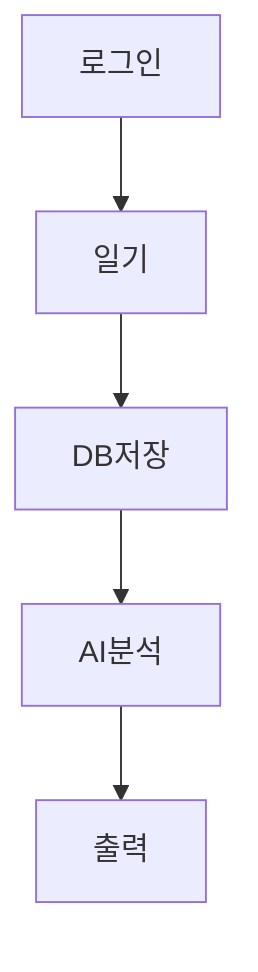

# Friendly Diary

#### *나의 하루를 위로 해주는 다이어리*

---
 
- ### 생성형 AI가 나의 기분을 파악하여 Youtube 음악과 음식을 추천해줍니다.

- ### 나의 일기와 추천 내용을 기록하고 조회합니다.

---

# 기술 스택과 적용 방식

### 1. 사용자 인증 & 로그인

- Spring Security : FormLogin 또는 OAuth2를 사용하여 로그인 처리
- JWT Token : 사용자 인증 및 인가. 세션 유지
- OAuth2 연동 : 구글 로그인

### 2. 일기 작성 및 저장

- 사용자는 웹 페이지에서 일기 작성
- MySQL에 저장
- 저장 후 감정 분석, 추천 내용 출력

### 3. 감정 분석

- Google Gemini API 를 활용하여 감정 분석
- RESTful API로 사용자의 일기 내용을 AI에 전달 -> 감정 결과를 JSON으로 반환

---
# 패키지 구조
📂 src/main/java/com/rolen/friendly_diary 
┣ 📂 config        (보안 및 인증 설정) 
┣ 📂 controller    (REST API 컨트롤러) 
┣ 📂 dto          (요청 및 응답 DTO) 
┣ 📂 entity       (JPA 엔티티) 
┣ 📂 repository   (DB 접근 레이어) 
┣ 📂 service      (비즈니스 로직) 
┣ 📂 security     (JWT 및 Security 관련 로직) 
┗ 📂 exception    (예외 처리) 

---

# 동작 흐름

